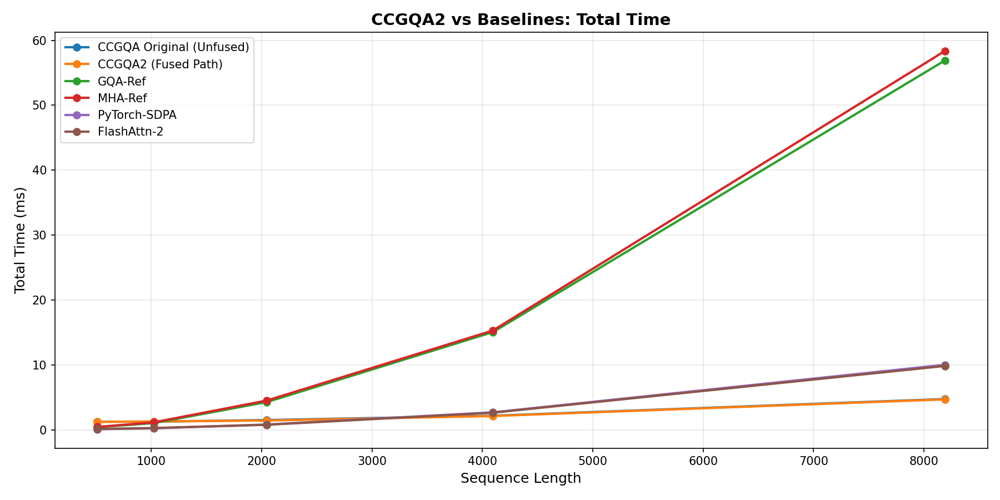
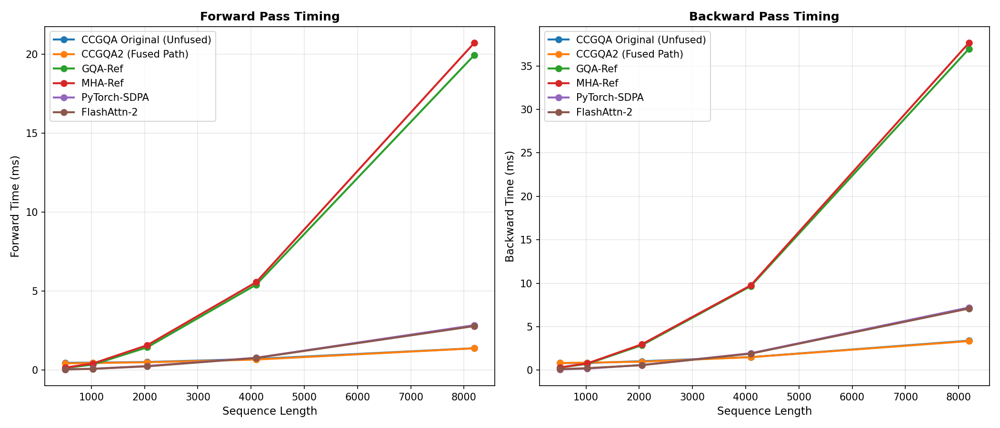
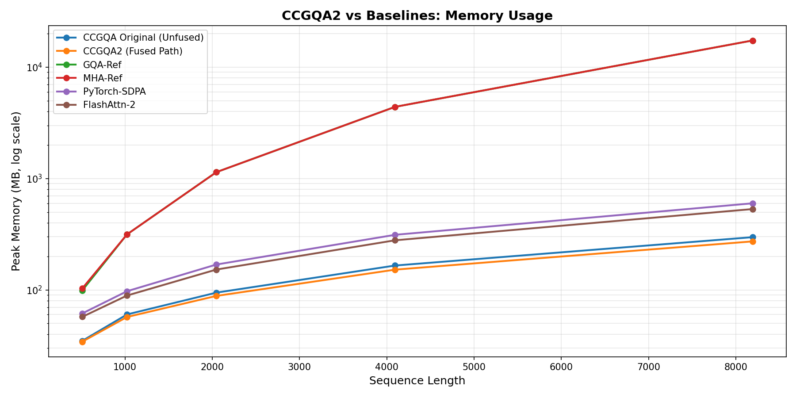

# CCGQA Baseline Performance

**Date**: December 22, 2024  
**Hardware**: NVIDIA GeForce RTX 5090 (33.7GB, SM 12.0)  
**PyTorch Version**: 2.x  
**Benchmark Script**: [benchmark.py](../benchmark.py)

## Executive Summary

This document establishes the baseline performance of CCGQA attention before optimization work. Key findings:

- ⚠️ **CCGQA is 4-12x slower than optimized baselines** (FlashAttn-2, PyTorch SDPA)
- ✓ **CCGQA uses 3-5x less memory** than standard GQA/MHA
- ⚠️ **Backward pass is the bottleneck** (64-82% of total time)
- 🎯 **Target**: Close gap to within 2x of FlashAttention-2 through kernel fusion

## Hardware Configuration

- **GPU**: NVIDIA GeForce RTX 5090
- **CUDA Compute**: SM 12.0
- **Memory**: 33.7GB GDDR7
- **Batch Size**: 4
- **Heads**: 8 (query), 2 (key-value)
- **Head Dim**: 64 (Model Dim: 512)
- **Compression**: 4x
- **Dtype**: bfloat16

## GPU Benchmark Results

### Sequence Length: 512

| Kernel | Forward (ms) | Backward (ms) | Total (ms) | Throughput (iter/s) | Memory (MB) | vs CCGQA |
|--------|-------------|---------------|-----------|---------------------|------------|----------|
| **CCGQA** | 0.51 | 2.33 | **2.84** | 352.1 | 31.3 | **1.0x** |
| GQA-Ref | 0.12 | 0.32 | **0.45** | 2244.4 | 98.2 | **6.3x faster** |
| MHA-Ref | 0.16 | 0.30 | **0.47** | 2142.5 | 102.4 | **6.1x faster** |
| PyTorch-SDPA | 0.04 | 0.19 | **0.23** | 4343.8 | 52.2 | **12.3x faster** |
| FlashAttn-2 | 0.05 | 0.26 | **0.31** | 3236.2 | 50.0 | **9.2x faster** |

**Key Observations (N=512)**:
- CCGQA backward pass takes **82%** of total time (2.33ms / 2.84ms)
- CCGQA uses **3.1x less memory** than GQA (31.3MB vs 98.2MB)
- PyTorch SDPA is the fastest baseline (hardware-optimized kernel)
- FlashAttention-2 is competitive but slightly slower than SDPA on this GPU

### Sequence Length: 1024

| Kernel | Forward (ms) | Backward (ms) | Total (ms) | Throughput (iter/s) | Memory (MB) | vs CCGQA |
|--------|-------------|---------------|-----------|---------------------|------------|----------|
| **CCGQA** | 0.52 | 0.93 | **1.46** | 686.0 | 58.3 | **1.0x** |
| GQA-Ref | 0.35 | 0.71 | **1.06** | 943.0 | 314.2 | **1.4x faster** |
| MHA-Ref | 0.40 | 0.79 | **1.19** | 840.1 | 314.2 | **1.2x faster** |
| PyTorch-SDPA | 0.09 | 0.20 | **0.29** | 3412.9 | 79.6 | **5.0x faster** |
| FlashAttn-2 | 0.10 | 0.23 | **0.33** | 3048.2 | 75.3 | **4.4x faster** |

**Key Observations (N=1024)**:
- CCGQA backward pass takes **64%** of total time (0.93ms / 1.46ms)
- CCGQA uses **5.4x less memory** than GQA (58.3MB vs 314.2MB)
- CCGQA's relative performance improves at longer sequences (gap narrows)
- Memory advantage grows with sequence length (3.1x → 5.4x)

### Visual Comparisons

Generated charts from benchmark run:


*Total execution time across sequence lengths - lower is better*


*Forward and backward pass timing - shows CCGQA's backward bottleneck*


*Peak memory consumption - CCGQA's primary advantage*

## Performance Analysis

### Root Cause: Why is CCGQA Slow?

1. **No Fused Attention Kernel**
   - CCGQA uses naive PyTorch operations (matmul, softmax)
   - Baselines use optimized CUDA kernels (FlashAttention, cuDNN)
   - Multiple memory round-trips vs single fused kernel

2. **Backward Pass Bottleneck**
   - Takes 64-82% of total time (should be ~50% ideally)
   - Complex gradient computation through compression + convolution
   - No custom backward kernel (relying on PyTorch autograd)

3. **Convolution Overhead**
   - Conv1d on Q and K adds latency
   - Not optimized for attention use case
   - Could benefit from depthwise-separable or custom kernel

4. **Memory Transfer Overhead**
   - Compression/decompression requires data movement
   - Intermediate tensors for Q-mean coupling, value-shift
   - Could be fused into single kernel

### Memory Advantage: Why is CCGQA Efficient?

1. **Compression Factor**: 4x reduction in attention matrix size
2. **Grouped Query Attention**: 2 KV heads vs 8 query heads
3. **No Attention Matrix Materialization**: Could fuse further

### Performance Opportunities (Prioritized)

#### 1. Fused Attention Kernel (Triton/CUDA) - **HIGH PRIORITY**
- **Expected Gain**: 3-5x speedup
- **Approach**: Fuse Q/K matmul + compression + attention + output
- **Reference**: FlashAttention-2 architecture, LA3 Triton kernels
- **Complexity**: High (requires Triton/CUDA expertise)

#### 2. Custom Backward Kernel - **HIGH PRIORITY**
- **Expected Gain**: 2-3x speedup on backward pass
- **Approach**: Implement fused backward through compression + attention
- **Complexity**: High (gradient math + kernel fusion)

#### 3. Optimized Convolution - **MEDIUM PRIORITY**
- **Expected Gain**: 1.5-2x speedup on conv operations
- **Approach**: Use depthwise-separable conv or inline into attention kernel
- **Complexity**: Medium (can leverage existing primitives)

#### 4. torch.compile Integration - **MEDIUM PRIORITY**
- **Expected Gain**: 1.3-1.8x additional speedup
- **Approach**: Ensure all ops are compile-friendly, add graph break guards
- **Complexity**: Low to Medium (mostly testing)

#### 5. Memory Layout Optimization - **LOW PRIORITY**
- **Expected Gain**: 1.2-1.5x speedup from reduced transfers
- **Approach**: Use contiguous memory, channels_last where applicable
- **Complexity**: Low (code cleanup)

### Combined Target

**Goal**: Achieve **≤2.0x slowdown** vs FlashAttention-2 while maintaining memory advantage

**Calculation**:
- Current gap: 9.2x @ N=512, 4.4x @ N=1024
- After kernel fusion (3-5x): 2-3x remaining gap
- After backward optimization (2x): 1-1.5x remaining gap
- After torch.compile (1.3x): **0.8-1.2x** (potentially matching or beating FlashAttn-2!)

**Realistic Target**: 2x slower than FlashAttn-2, 3-5x less memory

## Benchmarking Details

### How to Reproduce

```bash
# Quick benchmark (2 sequence lengths)
python hydra/attention/backends/ccgqa/benchmark.py --quick --device cuda --plot --save

# Full benchmark (4 sequence lengths)
python hydra/attention/backends/ccgqa/benchmark.py --device cuda --plot --save

# CPU benchmark
python hydra/attention/backends/ccgqa/benchmark.py --device cpu --save
```

### Output Files

- `docs/benchmark_results_YYYYMMDD_HHMMSS.json` - Raw benchmark data
- `docs/benchmark_comparison.png` - Total time chart
- `docs/fwd_bwd_comparison.png` - Forward/backward breakdown
- `docs/memory_comparison.png` - Memory usage chart

### Baseline Kernels

1. **CCGQA**: Our implementation (to be optimized)
2. **GQA-Ref**: Reference PyTorch GQA (naive implementation)
3. **MHA-Ref**: Reference PyTorch MHA (baseline)
4. **PyTorch-SDPA**: `F.scaled_dot_product_attention` (hardware-optimized)
5. **FlashAttn-2**: `flash_attn_func` (research kernel, optional)

## Next Steps

### Immediate Actions (Week 1)
1. ✅ Establish baseline benchmark infrastructure
2. ⬜ Profile CCGQA attention with `torch.profiler` to identify hotspots
3. ⬜ Implement simple Triton kernel for attention compute
4. ⬜ Measure improvement and iterate

### Short-term Goals (Weeks 2-4)
1. ⬜ Fuse forward pass (Q/K compression + attention)
2. ⬜ Implement custom backward kernel
3. ⬜ Optimize convolution operations
4. ⬜ Target: **≤3x slower** than FlashAttention-2

### Long-term Goals (Months 2-3)
1. ⬜ Full kernel fusion (forward + backward)
2. ⬜ torch.compile integration
3. ⬜ Multi-GPU optimization
4. ⬜ Target: **≤2x slower** than FlashAttention-2, publish results

## References

- **FlashAttention-2**: [Dao et al. 2023](https://arxiv.org/abs/2307.08691)
- **Lightning Attention 3**: [HYDRA internal, see backends/lightning_attn3/]
- **PyTorch SDPA**: [torch.nn.functional.scaled_dot_product_attention](https://pytorch.org/docs/stable/generated/torch.nn.functional.scaled_dot_product_attention.html)
- **Benchmark Script**: [benchmark.py](../benchmark.py)

---

**Last Updated**: December 22, 2024  
**Next Benchmark**: After implementing fused attention kernel (target: early 2025)
