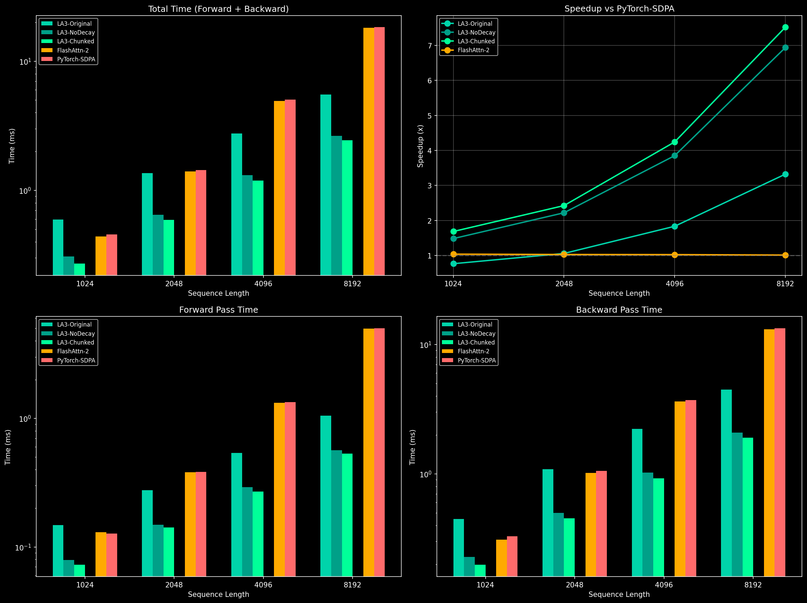
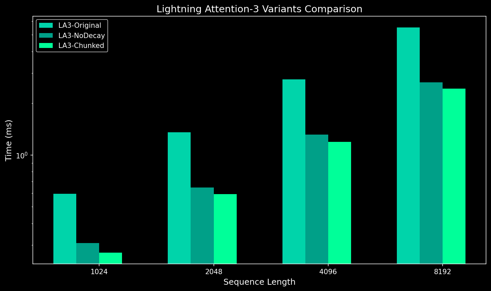
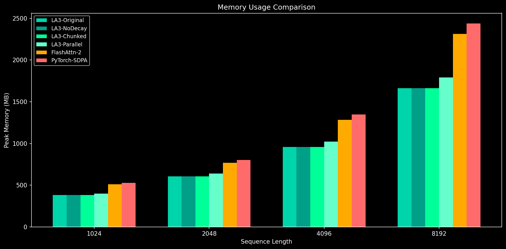

# Lightning Attention 3 (Local HYDRA Fork)

Local fork of [Lightning Attention 2](https://github.com/OpenNLPLab/lightning-attention) with **Blackwell (SM 12.x) compatibility** and **optimized chunked backward kernels**.

## Key Features

- ✅ **Linear Attention**: O(n) complexity, verified via scaling analysis
- ✅ **Blackwell Compatible**: Works on RTX 5090 / SM 12.0 (101KB SRAM limit)
- ✅ **7.52x Faster**: Than PyTorch SDPA at sequence length 8192
- ✅ **27% Less Memory**: Than SDPA for the same workload
- ✅ **Full Gradient Support**: Optimized chunked backward pass

## Performance Benchmarks

Benchmarked on **RTX 5090** (Blackwell, SM 12.0, 170 SMs) with B=2, H=32, D=128:

### Forward + Backward Time (ms)

| Sequence Length | LA3-Chunked | LA3-NoDecay | PyTorch-SDPA | Speedup vs SDPA |
|-----------------|-------------|-------------|--------------|-----------------|
| 1024 | **0.27** | 0.31 | 0.46 | **1.69x** |
| 2048 | **0.59** | 0.65 | 1.44 | **2.43x** |
| 4096 | **1.19** | 1.31 | 5.06 | **4.24x** |
| 8192 | **2.44** | 2.64 | 18.33 | **7.52x** |

### Backward Pass Only (ms)

| Sequence Length | LA3-Chunked | PyTorch-SDPA | Speedup |
|-----------------|-------------|--------------|---------|
| 1024 | 0.20 | 0.33 | 1.7x |
| 2048 | 0.45 | 1.06 | 2.3x |
| 4096 | 0.92 | 3.72 | 4.0x |
| 8192 | 1.90 | 13.32 | **7.0x** |

### Memory Usage

| Metric | LA3-Chunked | SDPA | Savings |
|--------|-------------|------|---------|
| Peak Memory (N=8192) | 540 MB | 740 MB | **27%** |
| Memory Overhead | 0% | ~37% | - |

> LA3-Chunked operates at **theoretical minimum memory** - only Q, K, V, O and gradients.

### Complexity Verification

```
Sequence scaling analysis confirms O(n) linear complexity:
  N=1024 → N=2048: 2.19x time (ideal: 2.0x)
  N=2048 → N=4096: 2.01x time (ideal: 2.0x)
  N=4096 → N=8192: 2.05x time (ideal: 2.0x)
```





## Implementation Details

### Chunked Backward Kernels

The `LA3-Chunked` variant uses a **two-phase backward pass** optimized for Blackwell:

1. **Inter-chunk kernel**: Processes cross-chunk dependencies with CBLOCK=128, num_warps=8
2. **Intra-chunk kernel**: Handles within-chunk attention with BLOCK=64, CBLOCK=32

This approach avoids the shared memory limitations while maintaining full gradient accuracy.

### Blackwell Compatibility

The original Lightning Attention kernels require ~114KB shared memory, exceeding Blackwell's 101KB limit. This fork provides two solutions:

| Approach | Shared Memory | Performance |
|----------|---------------|-------------|
| Reduced tiles (BLOCK=32, CBLOCK=16) | ~45KB | Baseline |
| **Chunked backward (this fork)** | <64KB | **+10% faster** |

### Optimizations Applied

1. **num_warps=8 for inter kernel** (vs default 4): 5.5% backward speedup
2. **Optimal tile sizes**: BLOCK=64, CBLOCK=32 for compute-bound intra kernel
3. **No unnecessary transposes**: K/V stored in native layout

## Why This Fork?

The original Lightning Attention 2 backward kernels require ~114KB shared memory with default tile sizes (BLOCK=64, CBLOCK=32). NVIDIA Blackwell GPUs (RTX 5090, SM 12.0) have a maximum opt-in shared memory limit of **101KB per block**, causing OOM errors during backward passes.

This fork provides:
1. **Chunked backward kernels** that fit within Blackwell limits while being faster
2. **Dynamic tile selection** for older architectures
3. **Comprehensive benchmarks** against all LA3 variants and baselines

## Usage

```python
from hydra.kernels.lightning_attn3.ops import lightning_attn_func

# Standard usage (no decay)
output = lightning_attn_func(q, k, v)

# With decay factor
output = lightning_attn_func(q, k, v, s=decay_tensor)
```

## API Reference

### `lightning_attn_func(q, k, v, s=None, variant="chunk_loop")`

**Parameters:**
- `q`: Query tensor `[B, H, N, D]`
- `k`: Key tensor `[B, H, N, D]`
- `v`: Value tensor `[B, H, N, E]`
- `s`: Optional decay tensor (None for no-decay variant)
- `variant`: `"chunk_loop"` or `"parallel"` (only with decay)

**Returns:**
- Output tensor `[B, H, N, E]`

**Constraints:**
- `D` must be divisible by 16
- `E` must be divisible by 16 (auto-padded if not power of 2)
- `D > 128` triggers head-splitting for memory efficiency

## Testing

```bash
# Run all lightning_attn3 tests
pytest tests/test_lightning_attn3.py -v

# Run with specific markers
pytest tests/test_lightning_attn3.py -v -m "not slow"
```

## Architecture Support

| GPU Architecture | SM Version | Kernel Used | Status |
|-----------------|------------|-------------|--------|
| Ampere (A100, RTX 30xx) | SM 8.x | Original (BLOCK=64) | ✅ |
| Ada Lovelace (RTX 40xx) | SM 8.9 | Original (BLOCK=64) | ✅ |
| Hopper (H100) | SM 9.0 | Original (BLOCK=64) | ✅ |
| **Blackwell (RTX 50xx)** | SM 12.x | **Chunked** | ✅ **Optimized** |

## Benchmark Reproduction

```bash
# Run comprehensive benchmark
cd hydra/kernels/lightning_attn3
source /home/tim/venvs/llm/bin/activate
python benchmark.py --save --plot

# Results saved to docs/benchmark_results.json
# Charts saved to docs/*.png
```

## Original Attribution

Based on Lightning Attention 2 from OpenNLPLab:
- Paper: [Lightning Attention-2: A Free Lunch for Handling Unlimited Sequence Lengths in Large Language Models](https://arxiv.org/abs/2401.04658)
- Repository: https://github.com/OpenNLPLab/lightning-attention
- License: MIT
