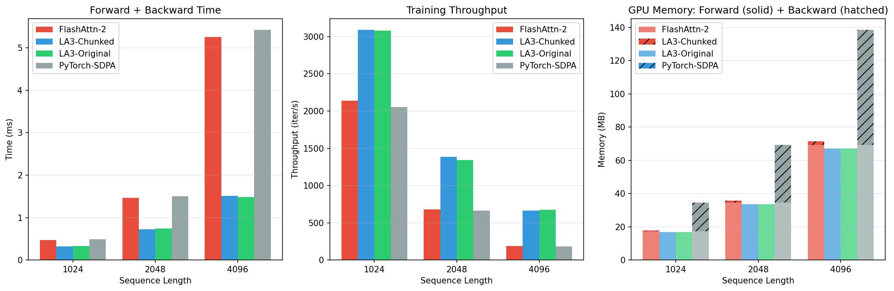
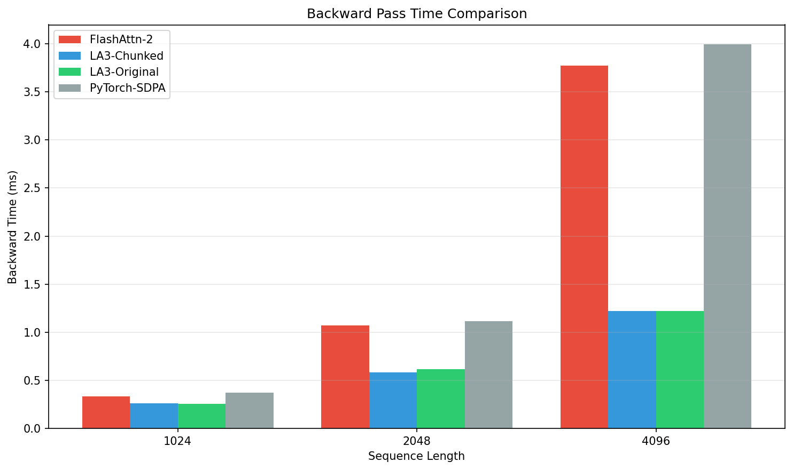

# Lightning Attention-3 Backward Kernel Benchmark Report

## System Configuration

| Property | Value |
|----------|-------|
| GPU | NVIDIA GeForce RTX 5090 |
| Compute Capability | SM 12.0 |
| Total Memory | 33.7 GB |
| Shared Memory (opt-in) | 101,376 bytes |
| SMs | 170 |

## Benchmark Configuration

| Parameter | Value |
|-----------|-------|
| Batch Size | 4 |
| Attention Heads | 32 |
| Head Dimension | 64 |
| Data Type | torch.float16 |
| Warmup Iterations | 10 |
| Benchmark Iterations | 50 |
| Sequence Lengths | [1024, 2048, 4096] |

## Kernels Tested

1. **LA3-Original**: Lightning Attention-3 with hardware-aware kernel selection
2. **LA3-Chunked**: Recompute-heavy chunked backward (Blackwell-optimized)
3. **FlashAttn-2**: FlashAttention-2 baseline (if available)
4. **PyTorch-SDPA**: PyTorch scaled_dot_product_attention baseline

## Results

### Detailed Measurements

| Kernel | SeqLen | Fwd (ms) | Bwd (ms) | Total (ms) | Throughput | Memory |
|--------|--------|----------|----------|------------|------------|--------|
| LA3-Original | 1024 | 0.07 | 0.26 | 0.32 | 3080.7 iter/s | 185 MB |
| LA3-Chunked | 1024 | 0.07 | 0.26 | 0.32 | 3088.7 iter/s | 185 MB |
| FlashAttn-2 | 1024 | 0.12 | 0.35 | 0.47 | 2141.6 iter/s | 186 MB |
| PyTorch-SDPA | 1024 | 0.11 | 0.37 | 0.49 | 2052.8 iter/s | 186 MB |
| LA3-Original | 2048 | 0.13 | 0.61 | 0.75 | 1342.3 iter/s | 369 MB |
| LA3-Chunked | 2048 | 0.14 | 0.58 | 0.72 | 1384.4 iter/s | 369 MB |
| FlashAttn-2 | 2048 | 0.40 | 1.07 | 1.47 | 680.7 iter/s | 371 MB |
| PyTorch-SDPA | 2048 | 0.40 | 1.11 | 1.50 | 665.0 iter/s | 371 MB |
| LA3-Original | 4096 | 0.26 | 1.23 | 1.49 | 672.2 iter/s | 738 MB |
| LA3-Chunked | 4096 | 0.27 | 1.24 | 1.51 | 660.8 iter/s | 738 MB |
| FlashAttn-2 | 4096 | 1.41 | 3.84 | 5.26 | 190.2 iter/s | 742 MB |
| PyTorch-SDPA | 4096 | 1.42 | 4.00 | 5.42 | 184.4 iter/s | 742 MB |

### Memory Breakdown

| Kernel | SeqLen | Fwd Mem (MB) | Bwd Mem (MB) | Activation (MB) | Peak (MB) |
|--------|--------|--------------|--------------|-----------------|----------|
| LA3-Original | 1024 | 17 | 0 | 0 | 185 |
| LA3-Chunked | 1024 | 17 | 0 | 0 | 185 |
| FlashAttn-2 | 1024 | 17 | 1 | 1 | 186 |
| PyTorch-SDPA | 1024 | 17 | 17 | 1 | 186 |
| LA3-Original | 2048 | 34 | 0 | 0 | 369 |
| LA3-Chunked | 2048 | 34 | 0 | 0 | 369 |
| FlashAttn-2 | 2048 | 35 | 1 | 1 | 371 |
| PyTorch-SDPA | 2048 | 35 | 35 | 1 | 371 |
| LA3-Original | 4096 | 67 | 0 | 0 | 738 |
| LA3-Chunked | 4096 | 67 | 0 | 0 | 738 |
| FlashAttn-2 | 4096 | 69 | 2 | 2 | 742 |
| PyTorch-SDPA | 4096 | 69 | 69 | 2 | 742 |

**Memory Definitions:**
- **Fwd Mem**: Memory allocated during forward pass only
- **Bwd Mem**: Additional memory allocated during backward pass (gradients + temporaries)
- **Activation**: Memory used to save tensors for backward pass
- **Peak**: Maximum total memory usage

### Relative Performance

Speedup vs PyTorch-SDPA baseline (higher = better):

| Kernel | N=1024 | N=2048 | N=4096 |
|--------|-----|-----|-----|
| FlashAttn-2 | 1.04x | 1.02x | 1.03x |
| LA3-Chunked | 1.50x | 2.08x | 3.58x |
| LA3-Original | 1.50x | 2.02x | 3.64x |
| PyTorch-SDPA | 1.00x | 1.00x | 1.00x |

## Analysis

### Key Findings

- **SeqLen 1024**: Best kernel is **LA3-Chunked** (0.32ms, 3088.7 iter/s)
- **SeqLen 2048**: Best kernel is **LA3-Chunked** (0.72ms, 1384.4 iter/s)
- **SeqLen 4096**: Best kernel is **LA3-Original** (1.49ms, 672.2 iter/s)

### Tradeoff Summary

| Kernel | Pros | Cons |
|--------|------|------|
| LA3-Original | Fast on pre-Blackwell GPUs, optimized tile sizes | May OOM on Blackwell (SM 12.x) |
| LA3-Chunked | Works on all GPUs including Blackwell, lower memory | Slightly slower due to recomputation |
| FlashAttn-2 | Highly optimized, low memory | Softmax attention (different algorithm) |
| PyTorch-SDPA | No dependencies, reliable | Generally slower than specialized kernels |

### Recommendations

1. **Pre-Blackwell GPUs (SM < 12)**: Use LA3-Original for best performance
2. **Blackwell GPUs (SM 12.x)**: Use LA3-Chunked (auto-selected by hardware-aware dispatch)
3. **Memory-constrained**: LA3-Chunked or FlashAttn-2 offer lower memory footprint
4. **Long sequences**: Linear attention (LA3) scales better than quadratic (FlashAttn-2)

## Plots

